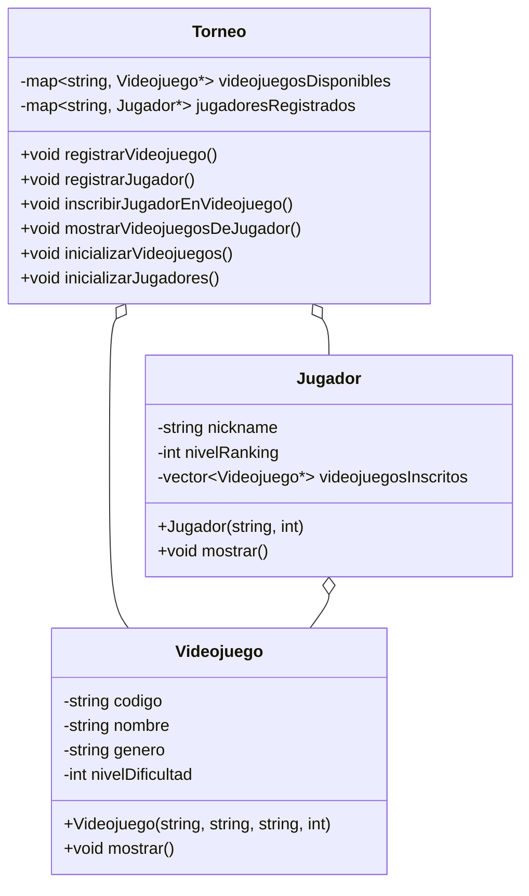

## 🏆 Battle Arena — Sistema de Gestión de Torneo de eSports

## Descripción
Vas a desarrollar un sistema de consola que permita gestionar las inscripciones de jugadores a videojuegos en el torneo **Battle Arena**.

El sistema debe permitir:

- Registrar videojuegos disponibles.
- Registrar jugadores.
- Inscribir jugadores a videojuegos existentes.
- Consultar la participación de jugadores.
- Calcular información agregada de los jugadores y sus videojuegos.


## Clases

### 🎮 Clase `Videojuego`
| Atributo | Descripción |
| -------- | ----------- |
| `codigo` | Código único del videojuego. |
| `nombre` | Nombre del videojuego. |
| `genero` | Género del videojuego (FPS, MOBA, Battle Royale, Fighting, etc.) |
| `nivelDificultad` | Nivel de dificultad de 1 (fácil) a 5 (difícil). |

### 👾 Clase `Jugador`
| Atributo | Descripción |
| -------- | ----------- |
| `nickname` | Apodo único del jugador. |
| `nivelRanking` | Nivel de habilidad general (1 a 100). |
| `videojuegosInscritos` | vector de punteros a `Videojuego`, representando sus inscripciones. |

### 🏟️ Clase `Torneo`
| Atributo | Descripción |
| -------- | ----------- |
| `videojuegosDisponibles` | `map<string, Videojuego*>`: catálogo oficial de videojuegos. |
| `jugadoresRegistrados` | `map<string, Jugador*>`: jugadores registrados en el torneo. |

## Funcionalidades mínimas
- Registrar un videojuego.
- Registrar un jugador.
- Inscribir un jugador a un videojuego.
- Mostrar los videojuegos en los que participa un jugador.
- Calcular y mostrar el promedio de dificultad de los videojuegos inscritos de un jugador.
- Salir.

## Restricciones obligatorias
- Solo pueden registrarse videojuegos únicos (según su `codigo`).
- Solo pueden registrarse jugadores únicos (según su `nickname`).
- Un jugador solo se puede inscribir en videojuegos que ya existan en el catálogo.
- Un jugador no debe inscribirse dos veces al mismo videojuego.
- Toda entrada o interacción del usuario debe ser validada:
    - Verificar existencia de juegos y jugadores antes de inscribir.
    - Validar rangos válidos para niveles y dificultades.
    - Validar que no haya inscripciones duplicadas.

## Recomendaciones deseables
- Implementa métodos de inicialización:
    ```cpp
    void inicializarVideojuegos();
    void inicializarJugadores();
    ```
- Esto te permitirá agilizar pruebas y carga de datos.
- Evita duplicación de datos haciendo uso correcto de punteros.
- Implementa menús claros, con mensajes comprensibles para el usuario.

## Relación entre `map` y `vector`
- El `map` actúa como el catálogo global de videojuegos.
- Cada jugador tiene un vector con punteros a videojuegos del catálogo.
- Esta relación evita duplicar videojuegos, compartiendo instancias entre múltiples jugadores.
- Cambios en los datos de un videojuego afectan automáticamente a todos los jugadores que lo tengan en su lista.

## Funcionalidades Opcionales (nivel extra)
- Mostrar un ranking de jugadores ordenado por `nivelRanking`.
- Permitir actualizar el `nivelRanking` de un jugador.
- Mostrar un listado completo de jugadores y en qué juegos están inscritos.

## Diagrama propuesto
> Puedes hacer modificaciones menores si lo consideras necesario

# ✅ Autoevaluación personal — Preparación para el examen parcial

**Instrucciones:**  
Marca con una **X** si cumples plenamente con lo que enuncia cada afirmación.  
Si no lo cumples o no estás seguro, deja el espacio en blanco.

---

## 🔵 Diseño orientado a objetos

| | Pregunta |
|---|----------|
| [ ] | Comprendo el propósito de cada clase (`Videojuego`, `Jugador`, `Torneo`) dentro del sistema. |
| [ ] | Sé identificar atributos y métodos relevantes de una clase a partir de un enunciado. |
| [ ] | Entiendo el diagrama de clases entregado y puedo explicar las relaciones entre las clases. |
| [ ] | Sé diferenciar entre una relación de asociación, composición y agregación. |
| [ ] | Comprendo el concepto de compartir instancias mediante punteros para evitar duplicación de objetos. |

---

## 🟣 Codificación orientada a objetos en C++

| | Pregunta |
|---|----------|
| [ ] | Sé implementar clases correctamente en C++ utilizando atributos privados y métodos públicos. |
| [ ] | Sé crear constructores adecuados y definir métodos para modificar o consultar atributos. |
| [ ] | Comprendo el uso de punteros en las relaciones entre clases. |
| [ ] | Soy capaz de navegar entre objetos relacionados usando punteros (ej.: acceder a los videojuegos inscritos desde un jugador). |
| [ ] | Puedo codificar de manera fluida la interacción entre las clases utilizando menús y llamadas a métodos. |

---

## 🟢 Contenedores en C++

| | Pregunta |
|---|----------|
| [ ] | Sé declarar y utilizar correctamente `vector` y `map`. |
| [ ] | Comprendo cómo recorrer un `vector` y un `map` para acceder y mostrar información. |
| [ ] | Puedo insertar, buscar y eliminar elementos en `map` y `vector`. |
| [ ] | Sé decidir cuándo usar un `map` y cuándo un `vector` dependiendo de la necesidad. |
| [ ] | Comprendo cómo integrar punteros dentro de `vector` y `map` para manejar referencias a objetos. |

---

## 🟡 Fluidez en la implementación

| | Pregunta |
|---|----------|
| [ ] | Sé crear y configurar correctamente un proyecto en **CLion**. |
| [ ] | Puedo crear los archivos `.h` y `.cpp` necesarios para las clases del sistema sin dificultad. |
| [ ] | Me siento cómodo escribiendo código desde cero aplicando los principios de orientación a objetos. |
| [ ] | Logro construir un menú de interacción funcional y bien estructurado. |
| [ ] | Soy capaz de realizar pruebas rápidas para verificar que las clases y métodos funcionan antes de terminar el programa completo. |

---

## ✨ Reflexión final

> Si al finalizar encuentras espacios sin marcar, identifica esos temas como oportunidades de mejora antes del parcial.  
> El examen evaluará directamente tu capacidad para:
> - Diseñar e interpretar modelos orientados a objetos.
> - Implementar clases y relaciones en C++ usando punteros y contenedores (`map`, `vector`).
> - Organizar y desarrollar un proyecto completo de forma fluida.

### 📚 Material de estudio recomendado

Aquí puedes consultar las actividades y materiales previos para reforzar los temas que necesites:

- [Diseño orientado a objetos](https://github.com/lufe089/POO/blob/main/2.Dise%C3%B1oOrientadoObjetos.md)
- [Codificación básica en C++](https://github.com/lufe089/POO/blob/main/3.CodificacionCpp.md)
- [Primera codificación de clases](https://github.com/lufe089/POO/blob/main/4.%20PrimeraCod.md)
- [Ejercicios de diseño orientado a objetos](https://github.com/lufe089/POO/blob/main/5.EjerciciosDise%C3%B1o.md)
- [Ejercicios de codificación con relaciones](https://github.com/lufe089/POO/blob/main/6.%20EjerciciosCod1Relaciones.md)
- [Contenedores en C++ (`vector`, `map` y otros)](https://github.com/lufe089/POO/blob/main/7.Contendores.md)

---
### 💎 Ejemplo completo recomendado

- 🏰 **Ejercicio Torres de Niza - Solución completa:**  
[Ver solución en GitHub](https://github.com/300CIS017-Object-Oriented-Programming/2025-1b-6b-memoria-dinamica-ejm_mem_dinamica_obj)

---
